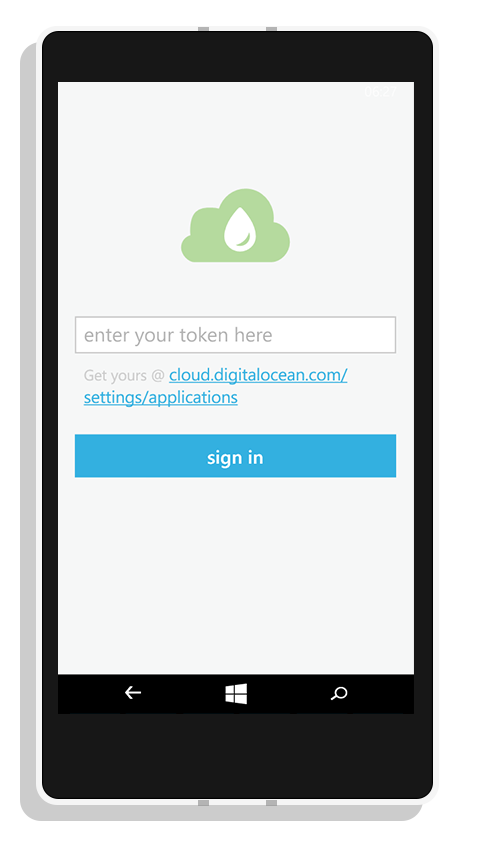
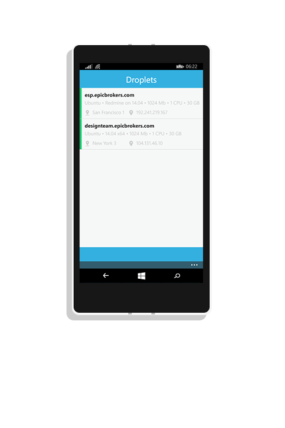
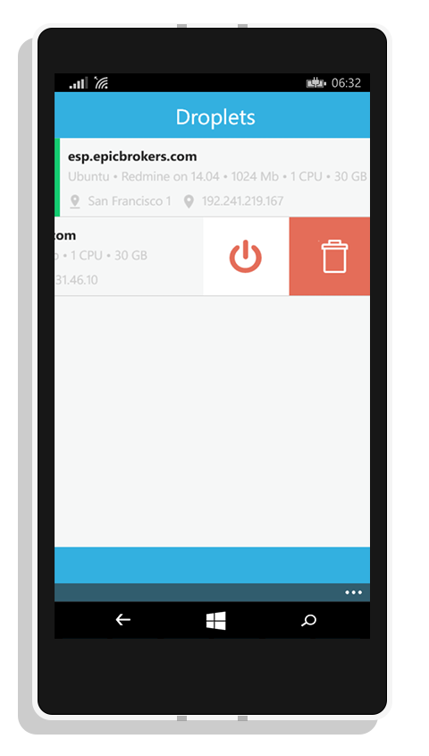
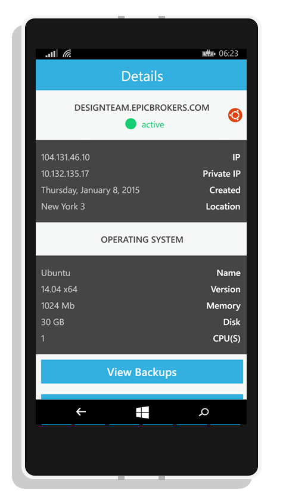
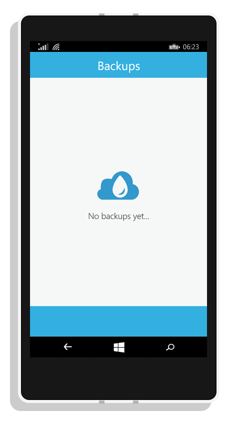

Drops for Windows Phone
============================

this project build for Digital Ocean Client for Windows Phone 8/8.1.

contact me:  info@brianmwadime.com / brianmwadime@gmail.com

hi.
The app uses digital Ocean's V2 API. UI preview below:

Enter Token Screen:
  

Dashboard Screen:
  

Droplet Actions Screen:
  

Droplet Details Screen:
  

Sample Empty Screen:
  
